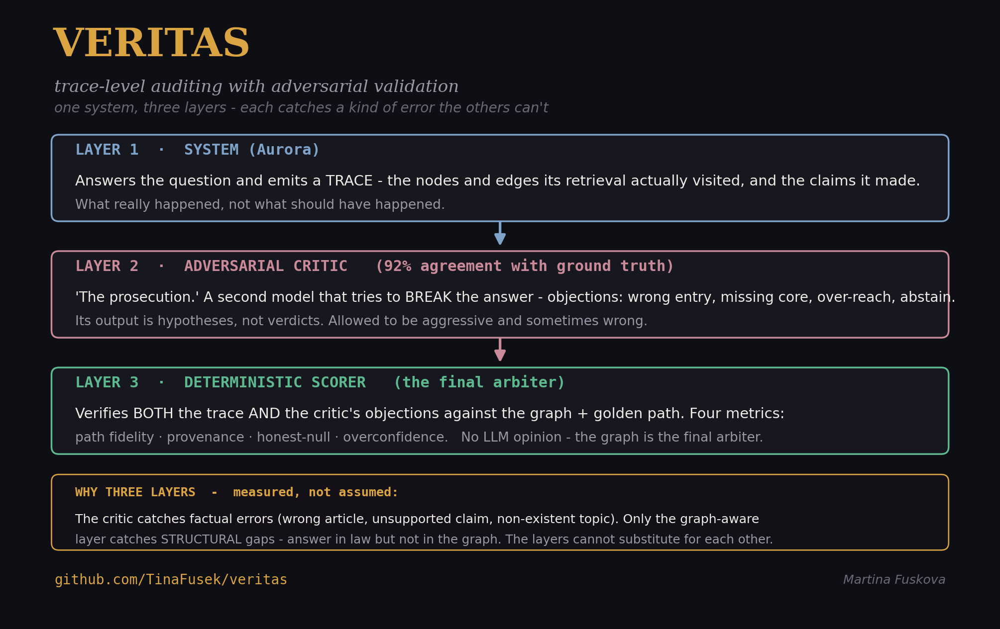

# VERITAS

[](https://doi.org/10.5281/zenodo.21919383)

**A benchmark that audits the *reasoning path* of GraphRAG systems — not just the answer text.**

Most RAG evaluations ask *"is the answer correct?"* VERITAS asks a harder question: *did the system reach that answer by a defensible path, and does it honestly say "I don't know" when the graph has no evidence?* It scores a system's execution **trace** against a human-annotated **golden** reasoning path, on four axes:

| Axis | Question it answers | Direction |
| --- | --- | --- |
| **Path fidelity** | Did it traverse the right edges of the graph? | higher = better |
| **Provenance coverage** | Are the answer's claims backed by traversed evidence? | higher = better |
| **Honest-null** | Does it abstain exactly when the graph can't answer? | higher = better |
| **Overconfidence** | Does it overstate weakly-supported claims? | lower = better |

The key design choice: the golden encodes the **correct path**, not the path the system happens to take. So a low score is a *localisation* of where retrieval diverges from correct reasoning — a finding, not a scoring artefact.

Scoring is **deterministic**: it compares the trace against the graph, rather than asking another LLM "was this good?" — which would share the blind spots of the model being judged.

---



---

## The layered audit

VERITAS is not a single check — it is a layered audit, where each layer catches a class of error the others cannot:

- **Layer 1 — the system** answers and emits a *trace* (the nodes and edges its retrieval visited, and the claims it made).
- **Layer 2 — an adversarial critic** (prompted as "the prosecution") tries to break the answer, proposing objections: wrong entry, missing obligation, over-reach, should-abstain. Its output is *hypotheses*, not verdicts.
- **Layer 3 — the deterministic scorer** verifies both the trace and the critic's objections against the graph and golden path. No LLM opinion — the graph is the final arbiter.

Each layer owns a distinct failure class, and the experiments below establish that they cannot substitute for one another. See [`docs/veritas-architecture-description.md`](docs/veritas-architecture-description.md) for the full description.

## Why this exists

In high-stakes settings — legal compliance, clinical information, safety-critical engineering — a fluent but wrongly-reasoned answer is worse than no answer, because you believe it. Answer-level metrics (faithfulness, answer relevancy) can't see *how* the system got there. VERITAS makes the reasoning path itself the unit of evaluation.

## Install

```
pip install veritas-graphrag        # from PyPI (once published)
# or, from source:
git clone https://github.com/TinaFusek/veritas && cd veritas
pip install -e ".[dev]"
```

## Quick start

Score a directory of traces against a directory of goldens (matched by `question_id`):

```
veritas --traces runs/traces-traversal --golden pilot/golden --out scores.json
```

Or from Python:

```
import json
from veritas.scorer import score_trace

golden = json.load(open("pilot/golden/aurora-q003.json"))
trace  = json.load(open("runs/traces-traversal/aurora-q003.json"))

score = score_trace(trace, golden)
print(score.path_fidelity["f1"], score.honest_null["category"])
```

## The two artefacts

A **golden** (`golden.schema.json`) specifies the edges a correct answer must traverse, each tagged `required` or `supporting`, with a required provenance grade — or, for out-of-scope questions, that the correct behaviour is abstention (`answerable: false`).

A **trace** (`trace.schema.json`) is what the system under test emits: the nodes and edges its retrieval actually visited, and the claims its answer made.

Both use the same edge identity — `source|type|target` — so they line up directly. See [`ANNOTATION_PROTOCOL.md`](ANNOTATION_PROTOCOL.md) for how goldens are annotated.

## What the metrics do (and don't) claim

- **Path fidelity** precision is *scoped to the edge types the golden annotates*. A system that correctly enters a node also traverses that node's other edge types; counting those against precision would punish correct retrieval for being thorough. The unscoped figure is reported alongside as `precision_unscoped` — the gap between them quantifies over-retrieval.
- **Provenance coverage** reports `grounded` (evidence resolves to a traversed edge), not just `linked` (evidence is gestured at). Claim matching is pluggable.
- **Honest-null** is a per-question boolean that becomes a *rate* only when aggregated over the out-of-scope slice.

## Results (Aurora / EU AI Act pilot)

Calibrated path fidelity on the answerable questions of the Aurora pilot, run against a live GraphRAG assistant over the full EU AI Act, versus a vector-only baseline. The annotated set has grown to 13 questions across obligations, classification, transparency, authorities, sanctions, and both out-of-scope and coverage-gap honest-null cases. Small *n* by design — the pilot validates that the metrics discriminate before scaling.

| Question | Path fidelity (F1) | Entered correctly? |
| --- | --- | --- |
| q003 — penalties for prohibited practices | **0.86** | yes (Art. 5) |
| q011 — deployer obligations | **0.59** | yes (Art. 26, the graph's hotspot) |
| q002 — provider documentation | 0.00 | no (entered Art. 82, not 11) |
| q005 — GPAI transparency | 0.00 | no (entered Art. 50, not 53) |
| q007 — exceptions under Art. 50 (Slovak) | 0.00 | no (cross-lingual miss) |

The vector-only baseline reconstructs **no** graph edges on any question. Each low number *names* a specific, reproducible failure — entry-point divergence, cross-lingual retrieval miss, over-retrieval — none of which is visible to answer-text correctness.

Further analyses: [`docs/veritas-layer-comparison.md`](docs/veritas-layer-comparison.md) (what each layer catches), [`docs/veritas-honest-null-analysis.md`](docs/veritas-honest-null-analysis.md) (two kinds of abstention), [`docs/veritas-crosslingual-analysis.md`](docs/veritas-crosslingual-analysis.md) (the critic as a language-agnostic drift detector).

## Two domains

Aurora (EU AI Act) is the validated pilot. **MatGraph** (Materials Project semiconductor data) shares the schema and scorer and is the second graph the framework is designed to transfer to; its traces are not yet annotated, so results are reported on Aurora only. The framework is graph-agnostic by construction — MatGraph transfer is ongoing work, not a validated claim.

## Tests

```
pytest -q          # 9 tests, including the precision-calibration invariant and the IAA kappa bounds
```

## Status & roadmap

**v1.1** — deterministic scorer (4 metrics, calibrated), layered audit with an adversarial critic, JSON schemas, annotation protocol, inter-annotator agreement tooling (`tools/iaa.py`), OpenTelemetry export, 13 annotated Aurora goldens, and the paper.

DOI (all versions): <https://doi.org/10.5281/zenodo.21919383>

Planned:

- Larger annotated dataset (20+ questions) and annotated MatGraph traces
- A completed inter-annotator agreement study (tooling is included)
- *Future work:* a planner layer that chooses the reasoning path before traversal; time-decaying confidence ("belief with a half-life")

## Citation

If you use VERITAS, please cite it — see [`CITATION.cff`](CITATION.cff) or the DOI above.

## License

MIT — see [`LICENSE`](LICENSE).
